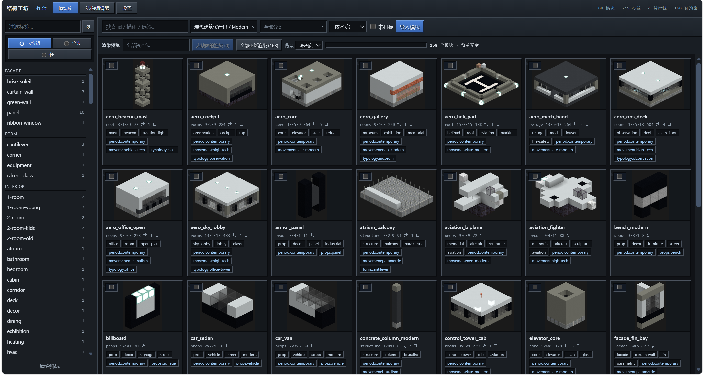

# structworkshop · 结构工坊

这是一个面向人类和ai的mc投影管理器.可以让ai调用你库中的投影进行参数化生成,模块化装配.

其具有如下功能
 1. 可视化的网页端,提供清晰的管理,编辑功能:
 2. 可以完善的存储,管理投影:

    1. 我们为每个投影文件创建了一个json文件存储它的属性,接口等数据,你可以在编辑器中编辑其属性,名称,描述等数据.

    2. 同时,我们在`packs/`文件夹中存储投影文件,我们将多个文件整合为资产包,我们在其中提供了一个例子,具体文件结构可以参考范例.

    3. 我们在`compositions`文件夹中存储建筑项目文件,它被用于生成一类建筑文件,存储了ai生成的,用于生成投影的python程序,以及项目成品与参考图.我们在其中也提供了一个例子,具体文件结构可以参考范例.

    4. 我们在`builds/`文件夹中存储成品文件,我们也为此提供了一个范例.

 3. 具有ai建筑生成以及人类与ai合作生成建筑的流程:
    ```
    提出需求
     │
     ① 检查仓库中的现有资源
     │
     ② 通过内置数据库查找查现实规范(如果有的话)
     │
     ③ 收集素材(通过网页搜索图片,视频资源,以及收集库中可用的投影,如果没有就自行生成)
     │
     ④ 生成建筑(写参数注入生成器,得到生成的投影)
     │
     ⑤ 打磨建筑(形体/材质/细节)                                
     │
     ⑥ 比对验收(使用内置工具渲染投影,然后交由视觉模型审查,然后重新进入打磨环节)
     │
     ⑦ 投影归档(放入特定文件夹中)
    ```

- 项目中提供了一些范例库,是作者让ai生成的

- 请注意,该项目**几乎完全基于vibecoding实现**,作者本人没有写过超过500行的程序.作者本人没有任何维护项目的经验,因此该项目目前没有版本更新(以后作者水平提高了也许会有),是一个类似demo的项目.

- 作者希望可以以此为ai与minecraft游戏的结合提供一个参考,希望之后可以出现更多使用ai生成建筑投影的项目.

- 请善用你的ai工具,如果遇到任何bug,你可以提出issue,同时使用你的ai工具解决问题,只需要向它提问,让它解决就可以了.

## 常用文件夹

| 文件夹 | 作用 |
|---|---|
| `packages/` | 作为项目的引擎（其中包含9个Python包以及浏览器工作台前端） |
| `compositions/` | 存储**一类投影的做法**,其中包括提示词,`build.py`生成器,预设参数,针对一类投影文件的`SKILL.md` |
| `packs/` | 存储投影素材包,其中包括投影文件,存储其属性,描述等数据的json文件,风格包,预览图 |
| `builds/` | 成品作品集归档 |
| `kb/` | 建筑规范语料 |
| `skills/` | 包括全部 skill,给ai提供方法索引与命令说明 |

---

## 安装

环境需要 **Python ≥ 3.10**（CI 覆盖 3.10 / 3.12，本机开发用 3.13）。

- 将下载的文件解压到一个文件夹,然后点击安装脚本.

    (这个脚本将生成一个虚拟环境,并自动下载依赖的python包,之后将命令注册到这个虚拟环境中,你可以让你的ai或者自己看一下脚本)

- 或者将文件路径复制给你的ai,让它帮你安装

---

## 快速开始
### 打开网页界面
使用命令
```shell
python -m mcstudio serve --open
```
或者
```shell
python3 -m mcstudio serve --open
```
### 使用ai生成投影文件
打开你的ai工具,并把你下载下来的文件夹设为目项目文件夹.

提出你的要求,ai会自动读取项目,然后开始按照其中skills提示的流程开始生成投影.


## 项目目录

```
packages/          引擎（pip install -e . 后全局可用）
├── mccore/        .schem/.litematic IO · 模块库 · 接口装配 · 分段建造 · 组合/项目/注册表 · 派生产物生成器
├── mckit/         建筑语法（窗/楼层线/竖肋/女儿墙/楼梯/中庭/广场）· 方块连接状态求解
├── mcrender/      真实方块模型 + 贴图的离线渲染（numba 光栅器）· 方块索引 · 画廊回归
├── mctools/       Axiom 式体素工具引擎（29 个工具 + 掩码 DSL），Web/HTTP/CLI 共用
├── mcqa/          质检 · 可行走性 · ASCII 预览 · 视觉评审回环
├── mcslice/       逆向：建筑 → 模块（切块）· 建筑 → 风格包（学习）
├── mcstudio/      本地工作台：模块库 + 3D 编辑器 + 装配 + 工具面板 + 设置（web/ 是前端）
├── mcmaterials/   方块材质目录 + 参考图反查 + 色彩审计
└── mckb/          规范语料库：release / chunk / FTS5(BM25) 检索 + OCR 流水线
compositions/      一类建筑 = 提示词 + 生成器 + 预设 + SKILL.md（每类一个目录）
packs/             资产包（本地内容）：模块 + 预览图 + 风格包 + pack.json
builds/            成品作品集（发布/回归基准）
kb/                规范语料库（完整标准文档 + 条款索引）
skills/            全部 skill（10 个，AI 的方法索引）；pi 经 .pi/settings.json 注册
tools/             自检小工具：ascii_view / whois / vreview / render_iso_alpha /
                   voxelize_models(.glb 倒模) / export_entity_models / lf_check
tests/             冒烟与审计（22 个 py + 6 个 node）
registry.json      机器可读的能力清单（组合 + 资产包 + 语料）—— 生成物，别手改
```
---

## 深入阅读

| 想了解 | 看 |
|---|---|
| **架构与内部实现**（数据模型 / 会话模型 / 渲染管线 / 契约 / 扩展食谱 / 术语表） | [AGENT.md](AGENT.md) |
| 使用与命令细节 | 本文 + `python -m <包> --help` |
| 包分层与依赖规则 | [packages/ARCHITECTURE.md](packages/ARCHITECTURE.md) |
| 某个包的职责 / 上游 / 不做 / API | `packages/<包>/README.md` |
| AI 的入口与方法索引 | `skills/structworkshop-overview/SKILL.md` |
| 注册表（机器可读能力清单） | `registry.json`、`python -m mccore.registry list` |

---

---

## 许可

MIT [LICENSE](LICENSE)

渲染与预览建立在两件开源工作上：
- **[deepslate](https://github.com/misode/deepslate)**
（MIT，这里使用了它的方块状态/模型解析)
- 渲染资源取自 [mcmeta](https://github.com/misode/mcmeta) 镜像.
